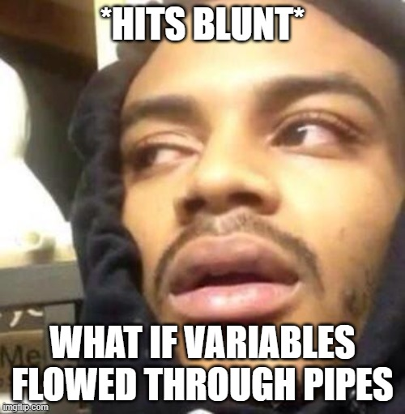

# Pyed

A fundamentally graphical programming language based on multicolored pipes.

(Coders using this language are thus Pyed pipers.)

## Installation

1. Ensure you have Python 3.7+ on your system: `python --version`
1. Clone this repository: `git clone https://github.com/elendiastarman/pyed`
1. Run whatever I'm playing with at the moment: `python scratch.py`

## Methodology

The core thesis of this language is that we can write programs in a fundamentally different way if it's based on graphical connections. Hopefully, this will also be more useful (at least sometimes).

A Pyed program consists of some number of **nodes** that are connected to each other using **pipes** wherein information just goes where its needed. Since this is intended to be a graphical programming language, some typical features of programming languages are greatly de-emphasized.

Chief among them are the (relative) **lack of explicit variables** and a tendency towards **simultaneous execution**. That is, a Pyed program tries to run as close to "all at once" as possible, evaluating nodes as soon as possible (without introducing inconsistencies).

### Lack of Explicit Variables

As this project is just getting off the ground, this is pretty much not possible yet when writing Pyed programs. However, in the core implementation, nodes refer to each other primarily by id, and names are only required to make the initial connection (to be honest, that's mostly so I'd be less frustrated while developing).

### Simultaneous Execution

A Pyed program executes in **stages** where a single stage represents all the work that can be done before ticking the clock, so to speak. In a typical programming language, summing a list involves advancing the program counter for each entry in the list and adding it to a running total. In Pyed, the internal implementation still does this, but for a Pyed coder, all that happens in one stage. Each node in a stage runs exactly once to avoid issues with runaway recursion.

### Pyed Pipes

While I have no problems writing code as text (it's my day job and I love it), I find well-designed visualizations to be incredibly interesting, engaging, and informative compared to the text equivalent. The prospect of visual programs have been on my mind for years and while languages like Scratch are indeed visual, I consider them to be visual wrappers around text languages.

**There's no reason code has to flow from top to bottom.**

When I write programs, I am simultaneously working with a mental model of what goes where *and* translating that into text, adjusting both while I'm writing bugs and fixing code. Pyed is my attempt to get closer to my mental model of a program.

One aspect of this mental model that I've been finding increasingly useful *and* increasingly irksome is **typing**. One of the reasons I love Python is that I don't have to declare types for my variables, but invalid operations will still fail. I've been slowly getting used to type annotations, introduced recently in Python, and while I wouldn't want to *have* to write them out all the time, being able to strictly define the behavior of complex internal methods was very useful.

One gripe I have with typing is that something like `Union[Optional[str], Dict[str, Optional[str]]]` is a hard-to-read way of saying "it's none, a str, or a dict from str to (none or a str)". The linearity of text and how it's presented are at odds with how the type naturally structured.

```
        none
       /
one of --- <str>
      \          none
       dict(str,  or  )
                 str
```

By expressing this visually, I'm looking to convey the same kind of information in a much more intuitive way. Also, consider this: syntax highlighting is so useful precisely because it conveys information in a more readily accessible *visual* way. :)

## Inspiration

